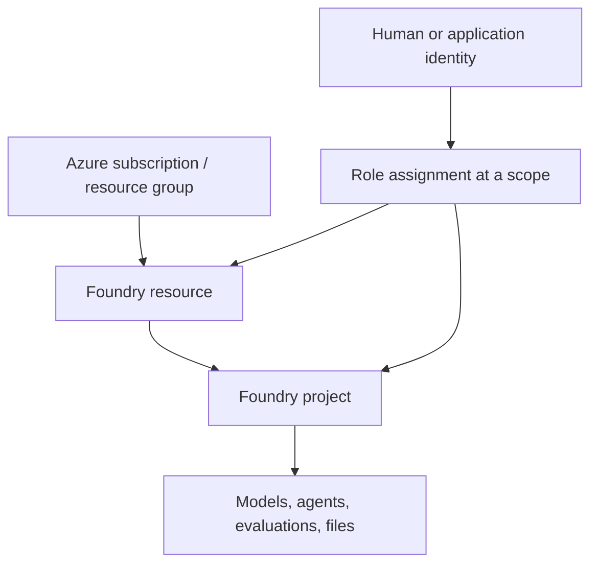

# What you should be able to do

After this lesson, you should be able to explain the difference between Foundry, a Foundry resource, a project, and a model or agent; distinguish control-plane management from data-plane use; identify the acting principal, task, and scope; and recognize when Hub guidance is for the classic experience.

**Time:** 60–90 minutes. **Prerequisites:** basic familiarity with Azure subscriptions and resource groups. No Azure resource creation is required.

# 1. Build the mental model

Microsoft Foundry is a platform for building and managing AI applications and agents. A Foundry resource is an Azure-managed environment; a project organizes work such as agents, evaluations, and files. Models are capabilities used or deployed within the environment. An agent combines a model with instructions and tools.

This is a starting model, not a complete deployment topology. Networking, storage, monitoring, and connected services may add resources and access rules.

# 2. Separate management from runtime

| Plane | Ask | Examples |
|---|---|---|
| Control plane | Can I create or configure this environment? | Create resources/projects, configure networking and connections, manage deployments, assign roles |
| Data plane | Can I use its runtime capabilities? | Run inference, interact with agents, run evaluations, use content-safety operations |

These planes have different authorization surfaces. A person able to create an Azure resource may still need a data-plane role to call an agent. An application may be allowed to call an agent without permission to reconfigure the resource.

# 3. Follow the identity

- **Developer:** signs in through Microsoft Entra ID; the user or group receives permissions for interactive work.
- **Application:** may use a managed identity or service principal. It is separate from you and needs its own access where required.
- **Agent consumer:** current RBAC guidance describes Foundry Agent Consumer for principals that only call agent endpoints.

Microsoft recommends Entra ID for production: it supports per-principal access and audit, managed identities, conditional access, and least-privilege RBAC. API keys can simplify isolated prototyping, but are shared secrets with coarser access and weaker identity traceability.

# 4. Think in role plus scope

A **role** describes allowed actions; a **scope** says which resources those permissions cover. Assign only what the principal needs at the narrowest workable scope.

Current Foundry RBAC guidance describes subscription, resource group, Foundry resource, Foundry project, and individual-agent endpoint scopes. Its getting-started pattern assigns Foundry User at the Foundry resource to both a developer and the project's managed identity. For endpoint-only callers, it describes Foundry Agent Consumer. These are starting patterns, not a substitute for checking the action's exact permission requirements.

Role names recently changed: Foundry User, Foundry Owner, Foundry Account Owner, and Foundry Project Manager were previously called Azure AI User/Owner/Account Owner/Project Manager. Older names may still appear during rollout.

# 5. Keep classic Hub material in context

Earlier material often uses a **Hub → Project** model. Microsoft labels that experience “Foundry (classic)” in relevant documentation; current guidance describes Foundry resources and projects. Classic hubs still matter when maintaining an older setup, but do not assume the old topology or roles are the default for a new project. Check the page's experience label before applying Hub instructions.

# Practice: make an access map

Use a hypothetical project; do not change Azure permissions for this exercise.

1. Draw subscription/resource group → Foundry resource → project.
2. Add the developer and any runtime identity.
3. Complete this table, using the current RBAC reference to check your choices.

| Principal | Task | Plane | Scope to investigate | Starting role to verify |
|---|---|---|---|---|
| Developer | Build and test an agent | Data plane | Project or resource | Foundry User |
| Project administrator | Create/configure resources, assign access | Control plane | Resource group/resource | Elevated management role |
| App managed identity | Call an agent | Data plane | Project or agent endpoint | Foundry Agent Consumer or task-specific role |

4. Circle tasks that cross planes. Note the extra permission surface instead of assuming one role covers both.

# Checkpoint

Explain: **Who is acting, what are they doing, and at what scope?**

Then answer:

1. Why might someone who can create a Foundry resource still be unable to call an agent?
2. Why treat an app's managed identity separately from the developer's sign-in?
3. What clue says Hub instructions may be for Foundry classic?

Suggested answers

1. Resource creation is a control-plane task; agent calls use the data plane and its authorization.
2. They are different principals with separate role assignments.
3. The docs label the Hub experience as classic; current guidance uses Foundry resource and project terminology.

# Next

Continue through the linked authentication and RBAC pages, then move to network and data boundaries. See the [course map](../course-map.md) for the sequence.
